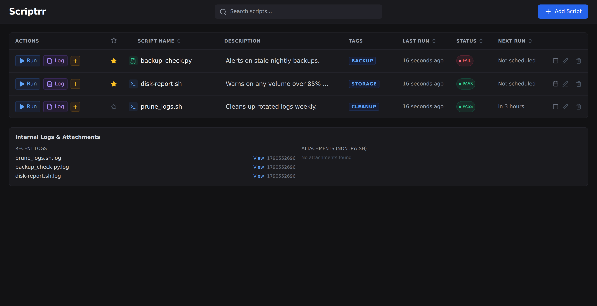
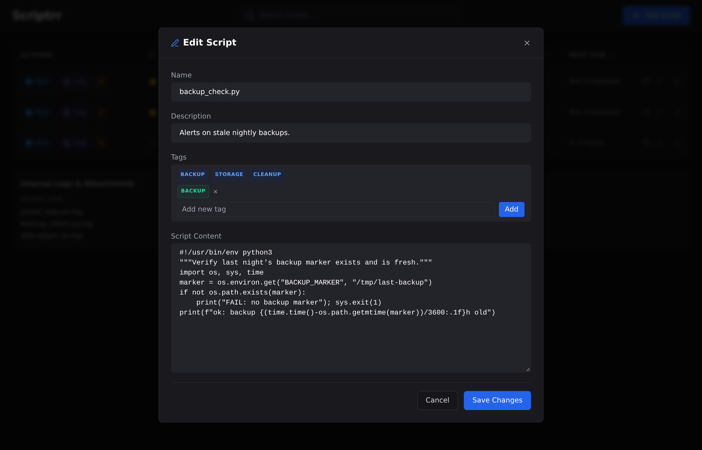
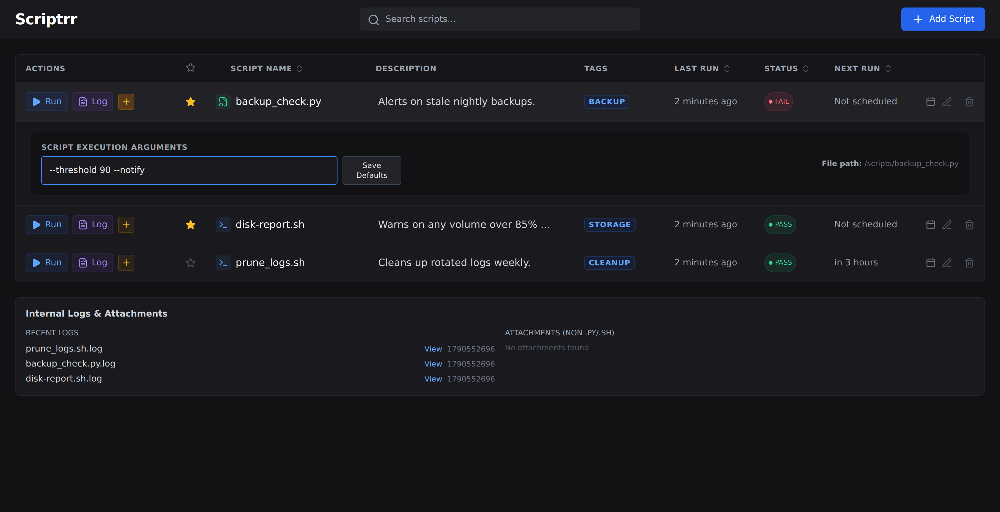

# scriptrr

**One place for the scripts you already run.**

Drop a script in and it lives here — listed, readable, runnable on demand. Add a
schedule when you want one. Give it a lifecycle when it's a standing intention.
Nothing is required.



Every recurring job follows one loop: **declare why → run → observe → notify →
act → close**. Today those pieces live in different tools and *you* are the glue:
cron runs it, a heartbeat service watches it, an alert channel pings you, a note
remembers why. scriptrr holds the whole loop as one contained object — so you can
see what a job is *for*, when it *runs*, whether it's *alive*, what it *last
said*, and when it *ends*.

## Why

- **Everything is opt-in.** A script with no schedule, no state, no alerts is not
  incomplete. It is a first-class citizen.
- **Your scripts stay yours.** Plain files, self-contained, runnable outside
  scriptrr. It holds intent — never a cage.
- **One loop, done well.** No executors, no orchestration. The job owns its
  lifecycle.
- **Contained and human-legible** is the product. If a feature doesn't serve the
  loop, it doesn't belong.

## Features

- **List & run** any `.py` / `.sh` script from a clean web dashboard.
- **Live output** while a run is in progress, plus a per-run **log** view.
- **Cron scheduling** per script, with a human-readable next-run time.
- **Edit in place** — view and change a script's source straight from the UI.

  

- **Arguments** per script, with saved defaults used by scheduled runs.

  

- **Descriptions, tags, starring, search**, and sortable columns.
- **Upload** an existing script or **create** one in the browser.
- **Tiers**: start with nothing; add a schedule, then state, then judgment — each
  additive, never required.

## Quick start

```sh
docker run -d \
  --name scriptrr \
  -p 8000:8000 \
  -v "$PWD/scripts:/app/scripts" \
  zenxedo/scriptrr:latest
```

Open <http://localhost:8000/>. Anything you mount at `/app/scripts` shows up in
the dashboard. To keep metadata and logs across container rebuilds, mount those
too:

```sh
  -v "$PWD/scripts:/app/scripts" \
  -v "$PWD/data/scriptrr.db:/app/scriptrr.db" \
  -v "$PWD/data/logs:/app/logs" \
```

> **Running as non-root.** The image runs as uid `1000`, so the host files you
> mount must be writable by that user — e.g. `chown -R 1000:1000 ./data`.

### Docker Compose

```yaml
services:
  scriptrr:
    image: zenxedo/scriptrr:latest
    container_name: scriptrr
    ports:
      - "8000:8000"
    volumes:
      # Mount your scripts — anything here shows up in the dashboard.
      - ./scripts:/app/scripts
      # Optional: persist metadata (schedules/tags) and run logs.
      - ./data/scriptrr.db:/app/scriptrr.db
      - ./data/logs:/app/logs
    restart: unless-stopped
```

## Script dependencies

The published image contains only the app. If your scripts need extra Python
packages or system tools, build a thin image on top of it:

```dockerfile
FROM zenxedo/scriptrr:latest
USER root
RUN apt-get update && apt-get install -y --no-install-recommends jq \
    && rm -rf /var/lib/apt/lists/*
RUN pip install --no-cache-dir requests
USER scriptrr
```

## How scripts run

- `.py` files run with `python3 -u`; `.sh` files run with `bash`.
- A run's stdout/stderr is written to `logs/<script>.log`; the previous log is
  archived first.
- Scheduled runs use each script's saved **default arguments**.
- Scripts are self-contained: they carry their own config and run the same under
  scriptrr, cron, or an interactive shell.

### A self-retiring nudge

A *nudge* is a standing intention: *"I already decided to act when X happens;
ping me when X happens, then stop."* The job owns the whole loop and closes
itself out — no zombie cron that nags forever.

```python
EXPIRES = "2026-10-27"          # hard fallback; "" disables
# ...
if state.get("done"):           # terminal condition already met
    retire("already done")      # no-op + best-effort unschedule
if EXPIRES and today() > EXPIRES:
    retire("expired")

# ...do the check...
if condition_met:
    notify(title, message)      # the actionable ping
    retire("condition met")     # alert once, then disappear
```

The state file is the job's memory; `done` and `EXPIRES` are its off-switch.
Under scriptrr the job unschedules itself; under plain cron the same script just
no-ops after expiry, so it stays portable.

## Security

**scriptrr ships with no authentication.** Anyone who can reach the port can add,
edit, run, and delete scripts — and execute arbitrary code on the host with the
container's permissions. Treat it as a trusted-LAN tool:

- Do **not** expose it directly to the internet.
- Put it behind a reverse proxy that provides auth (Authelia, oauth2-proxy,
  basic auth), or reach it over a VPN / Tailscale.
- Mount only the paths your scripts actually need. Mounting the Docker socket or
  a broad host path widens the blast radius.

## License

MIT — see [LICENSE](LICENSE).
